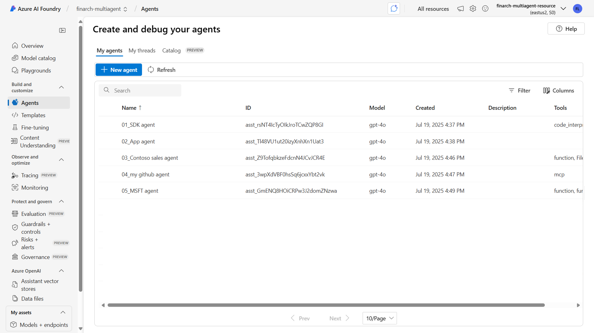

# 🚀 Azure AI Agent with MCP Tools

本案示範如何使用 Azure AI Agent 執行各種 AI 任務，包括基礎、中階、進階，以及與 MCP 整合的應用，並提供 Jupyter Notebook 及 Python 範例。

This repository demonstrates how to use Azure AI Agent for various AI tasks, including basic, intermediate, advanced, and MCP-integrated applications. It provides examples in both Jupyter Notebooks and Python scripts. Please see [the user guide](#The-User-Guide) at the bottom.

## 1. 專案下載

下載本專案：
```bash
git clone https://github.com/ownway22/azure-ai-agent.git
```

進入專案資料夾：
```bash
cd azure-ai-agent
```

## 2. 環境建置

#### 方法一：典型方式
1. 建立虛擬環境：
   ```bash
   python -m venv .venv
   ```
2. 啟用虛擬環境：
   - Windows PowerShell 指令：
     ```powershell
     .venv\Scripts\Activate
     ```
   - CMD 指令：
     ```cmd
     .venv\Scripts\activate.bat
     ```
   - macOS/Linux 指令：
     ```bash
     source .venv/bin/activate
     ```
3. 安裝所需套件：
   ```bash
   pip install -r requirements.txt
   ```

#### 方法二：使用 `uv sync`
1. 快速建立與安裝虛擬環境：
   ```bash
   uv sync
   ```
2. 啟用虛擬環境：
   - Windows PowerShell 指令：
     ```powershell
     .venv\Scripts\Activate
     ```
   - CMD 指令：
     ```cmd
     .venv\Scripts\activate.bat
     ```
   - macOS/Linux 指令：
     ```bash
     source .venv/bin/activate
     ```

## 3. 修改環境變數

請到 [Azure AI Foundry Project](https://learn.microsoft.com/en-us/azure/ai-foundry/) 複製您 AI project 中相關的環境變數，並將其填入 `.env` 檔案中。
```bash
PROJECT_ENDPOINT="https://*****.services.ai.azure.com/api/projects/*****"
API_KEY="86CBilkUxBKM3s8VYa7blR40bgIkDGhYnDys*****"
MODEL_DEPLOYMENT_NAME="gpt-4o"

AZURE_OPENAI_ENDPOINT="https://openai-ai-workshop.openai.azure.com/"
AZURE_OPENAI_API_KEY="AYj128C1av4Y9MLl01p5k6tIRY6pYRWOPjH*****"
AZURE_OPENAI_CHAT_DEPLOYMENT_NAME="gpt-4o"
AZURE_OPENAI_API_VERSION="2025-01-01-preview"
AZURE_BING_CONNECTION_ID="*****"
```

## 4. Azure CLI 登入 (az login)

在執行範例前，請先安裝並登入 Azure CLI：

1. 若尚未安裝 Azure CLI，請參考官方說明：[如何安裝 Azure CLI](https://learn.microsoft.com/en-us/cli/azure/install-azure-cli?view=azure-cli-latest)
2. 登入 Azure 帳號：
   - Windows (PowerShell 或 CMD)：
     ```powershell
     az login
     ```
   - macOS / Linux (Terminal)：
     ```bash
     az login
     ```

執行後會自動開啟瀏覽器進行帳號驗證，登入成功即可繼續後續步驟。

## 5. 開始執行範例

依序執行以下檔案：
1. `01_ai-agent-basic.ipynb`
2. `02_ai-agent-intermediate.py`
3. `03_ai-agent-advanced.py`
4. `04_ai-agent-mcp-basic.ipynb`
5. `05_ai-agent-mcp-intermediate.py`
6. `06_ai-agent-mcp-advanced.py`

#### 執行 Jupyter Notebook 範例：
```bash
pip install notebook
jupyter notebook
```
然後在瀏覽器中開啟上述的 `.ipynb` 檔案。

#### 執行 Python 範例：
```bash
python 02_ai-agent-intermediate.py
python 03_ai-agent-advanced.py
python 05_ai-agent-mcp-intermediate.py
python 06_ai-agent-mcp-advanced.py
```

## 6. 完成後的結果

當所有程式碼執行完成後，您可以在 Azure AI Foundry portal 的 agent 清單中看到如下畫面：



該畫面顯示已成功建立的 agent 清單，包含其名稱、ID、模型類型、建立時間等資訊。

---
## The User Guide
This repository demonstrates how to use Azure AI Agent for various AI tasks, including basic, intermediate, advanced, and MCP-integrated applications. It provides examples in both Jupyter Notebooks and Python scripts.

## 1. Project Download

Download the repository:
```bash
git clone https://github.com/ownway22/azure-ai-agent.git
```

Navigate to the project folder:
```bash
cd azure-ai-agent
```

## 2. Environment Setup

#### Option 1: Typical Setup
1. Create a virtual environment:
   ```bash
   python -m venv .venv
   ```
2. Activate the virtual environment:
   - Windows PowerShell:
     ```powershell
     .venv\Scripts\Activate
     ```
   - CMD:
     ```cmd
     .venv\Scripts\activate.bat
     ```
   - macOS/Linux:
     ```bash
     source .venv/bin/activate
     ```
3. Install required packages:
   ```bash
   pip install -r requirements.txt
   ```

#### Option 2: Using `uv sync`
1. Quickly set up and install the virtual environment:
   ```bash
   uv sync
   ```
2. Activate the virtual environment:
   - Windows PowerShell:
     ```powershell
     .venv\Scripts\Activate
     ```
   - CMD:
     ```cmd
     .venv\Scripts\activate.bat
     ```
   - macOS/Linux:
     ```bash
     source .venv/bin/activate
     ```

## 3. Modify Environment Variables

Go to the [Azure AI Foundry Project](https://learn.microsoft.com/en-us/azure/ai-foundry/) to copy the relevant environment variables for your AI project and add them to the `.env` file:
 ```bash
PROJECT_ENDPOINT="https://*****.services.ai.azure.com/api/projects/*****"
API_KEY="86CBilkUxBKM3s8VYa7blR40bgIkDGhYnDys*****"
MODEL_DEPLOYMENT_NAME="gpt-4o"

AZURE_OPENAI_ENDPOINT="https://openai-ai-workshop.openai.azure.com/"
AZURE_OPENAI_API_KEY="AYj128C1av4Y9MLl01p5k6tIRY6pYRWOPjH*****"
AZURE_OPENAI_CHAT_DEPLOYMENT_NAME="gpt-4o"
AZURE_OPENAI_API_VERSION="2025-01-01-preview"
AZURE_BING_CONNECTION_ID="*****"
```

## 4. Azure CLI Login (az login)

Before running the examples, install and log in to the Azure CLI:

1. If you haven't installed the Azure CLI yet, follow the official guide: [Install the Azure CLI](https://learn.microsoft.com/en-us/cli/azure/install-azure-cli?view=azure-cli-latest)
2. Log in to your Azure account:
   - Windows (PowerShell or CMD):
     ```powershell
     az login
     ```
   - macOS / Linux (Terminal):
     ```bash
     az login
     ```

This will automatically open a browser for account verification. Once logged in, you can proceed to the next steps.

## 5. Run Examples

Execute the following files in order:
1. `01_ai-agent-basic.ipynb`
2. `02_ai-agent-intermediate.py`
3. `03_ai-agent-advanced.py`
4. `04_ai-agent-mcp-basic.ipynb`
5. `05_ai-agent-mcp-intermediate.py`
6. `06_ai-agent-mcp-advanced.py`

#### Run Jupyter Notebook examples:
```bash
pip install notebook
jupyter notebook
```
Then open the `.ipynb` files in your browser.

#### Run Python script examples:
```bash
python 02_ai-agent-intermediate.py
python 03_ai-agent-advanced.py
python 05_ai-agent-mcp-intermediate.py
python 06_ai-agent-mcp-advanced.py
```

## 6. Results After Completion

After executing all the code, you can see the agent list in the Azure AI Foundry portal as shown below:


This screen displays the list of successfully created agents, including their names, IDs, model types, creation times, and other information.

---

# Reference

#### 01_ai-agent-basic.ipynb
1. [Quickstart - Create a new Azure AI Foundry Agent Service project (2025/07)](https://learn.microsoft.com/en-us/azure/ai-foundry/agents/quickstart?pivots=programming-language-python-azure)
2. [Azure AI Projects client library for Python - version 1.0.0b12 (2025/06)](https://learn.microsoft.com/en-us/python/api/overview/azure/ai-projects-readme?view=azure-python-preview)
3. [Azure AI Agents client library for Python - version 1.0.2 (2025/07)](https://learn.microsoft.com/en-us/python/api/overview/azure/ai-agents-readme?view=azure-python)

#### 02_ai-agent-intermediate.py
4. [azure-sdk-for-python by dargilco (2025/06)](https://github.com/Azure/azure-sdk-for-python/tree/azure-ai-projects_1.0.0b12/sdk/ai/azure-ai-agents/samples/agents_async)

#### 03_ai-agent-advanced.py
5. [Build your code-first agent with Azure AI Foundry](https://microsoft.github.io/build-your-first-agent-with-azure-ai-agent-service-workshop/)

#### 04_ai-agent-mcp-basic.ipynb
6. [Announcing Model Context Protocol Support (preview) in Azure AI Foundry Agent Service | Azure AI Foundry Blog (2025/06)](https://devblogs.microsoft.com/foundry/announcing-model-context-protocol-support-preview-in-azure-ai-foundry-agent-service/)
7. [Code Samples for the Model Context Protocol Tool (Preview) - Azure AI Foundry | Microsoft Learn (2025/07)](https://learn.microsoft.com/en-us/azure/ai-foundry/agents/how-to/tools/model-context-protocol-samples?pivots=python)
8. [Create a Remote MCP server for your GitHub repository](https://gitmcp.io/)

#### 05_ai-agent-mcp-intermediate.py
9. [QuickStart to MCP Tools Development with Azure AI Foundry SDK (2025/07)](https://techcommunity.microsoft.com/blog/azure-ai-services-blog/ai-agent-mcp-tools-quickstart-to-mcp-tools-development-with-azure-ai-foundry-sdk/4432464)
10. [AI-Foundry-Agent-MCP by Christian Coello (2025/07)](https://github.com/ccoellomsft/AI-Foundry-Agent-MCP)

#### 06_ai-agent-mcp-advanced.py
11. [Build a MCP client using Azure AI Foundry and OpenAI Agents SDK (2025/04)](https://medium.com/@eitansela/build-a-mcp-client-using-azure-ai-foundry-and-openai-agents-sdk-6c8e372f3a6a)
12. [ai-foundry-agents-samples by Eitan Sela (2025/07)](https://github.com/Azure-Samples/ai-foundry-agents-samples/tree/main)
13. [Office PowerPoint MCP server](https://playbooks.com/mcp/office-powerpoint)
14. [Excel Data Manager MCP server](https://playbooks.com/mcp/excel-data-manager)

#### More
15. [AI Repo of the Week: MCP for Beginners | Microsoft Community Hub (2025/05)](https://techcommunity.microsoft.com/blog/azuredevcommunityblog/ai-repo-of-the-week-mcp-for-beginners/4416767)
16. [10 Microsoft MCP Servers to Accelerate Your Development Workflow - Microsoft for Developers (2025/07)](https://devblogs.microsoft.com/blog/10-microsoft-mcp-servers-to-accelerate-your-development-workflow)
